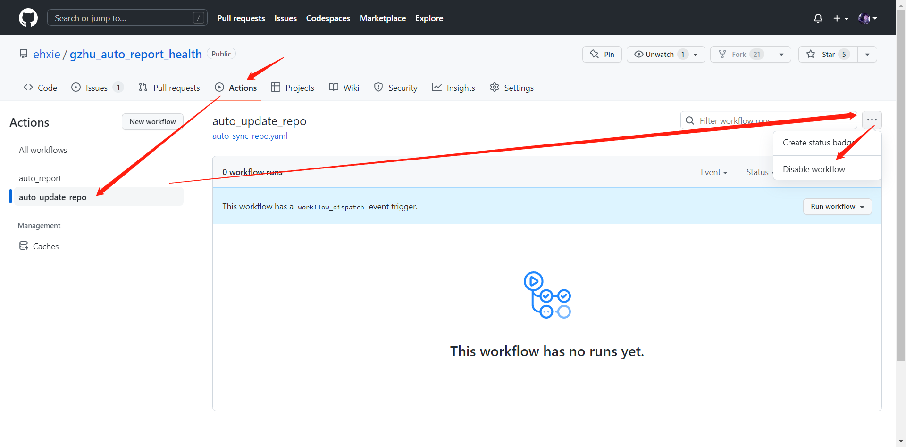
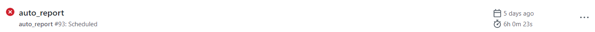

# 广州大学 GZhu 自动健康打卡 TypeScript 版

## 免责声明

本项目仅用于学习交流，请如实上报健康情况！

## 功能简介

- 使用 Github Actions 实现广州大学自动健康打卡
- 账号密码均由自己秘密保存

## 使用指南

简单三步，开启自动健康打卡

- fork 本仓库
- 填写学号、密码（加密保存到**你自己**的仓库中）
- 开启自动打卡

1.`fork`本项目，跳转到另一个页面，再点击`creat fork`

2.设置学号、密码

- 依次点击`Settings` ——>`Secrets`——>`Actions`

- 点击`New repository secret`
  - Name：填入密钥名称
    - `STUDENT_NUMBER`：学号
    - `PASSWORD`：密码
  - Secret：填入密钥

例如：

3.开启自动打卡（Github Action）

- 开启 Github Action

**测试是否设置成功**

- 按下图步骤 1，2 触发自动打卡，等到前面图标变成`绿色的√`时自行查看健康打卡系统

## 拓展功能（可选）

### 结果通知

> 打卡结果通过微信公众号`pushplus 推送加`通知

1.关注微信公众号`pushplus 推送加`，它会返回一个 `token`（下图打码部分）

 

2.按照上面添加账号密码的方式添加一个 `secret`

- Name 为 PUSHPLUS，Secret 为步骤1获得的 token

### 自动同步仓库

由于健康上报表格改变导致打卡失败，需要作者更新下代码，更新后需要通知**所有人**同步仓库，这是一件很麻烦的事情，且很难做到，所以本仓库已**自动**开始自动与源仓库同步代码

如果不需要该功能请自行关闭（如下）

## 常见问题

### 设置了公众号通知，但是没有收到通知

目前还没排查出来，但这个问题比较小几率发生，如果遇到了请当天自行打卡即可

### 打卡失败

可能原因如下：

1.由于 Github Action 是在国外服务器上运行的，所以访问国内网站速度较慢，况且健康上报网页通常都很卡，所以有一定几率是网络问题导致打卡失败，自行打卡即可。（几率很小）

2.早上 7 点健康上报网页有时候根本进不去（早起打卡的同学就知道，系统一直进不去），所以也就打卡失败了（几率比 1 大些），自行打卡即可。

3.健康上报表格改变，这个是必定会导致失败的，需要作者修复该问题，然后大家同步我的代码即可，第二天就可以恢复正常。

> 出现打卡失败都需要大家**手动进行打卡**，后续可能会新增失败重试，即可只在 3 的情况才下需要自行打卡！
