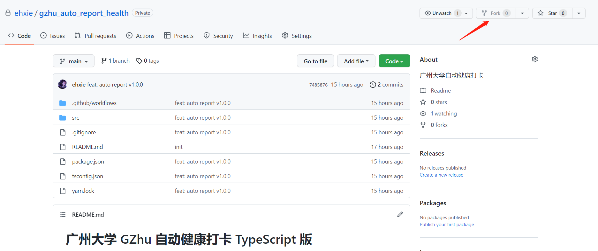
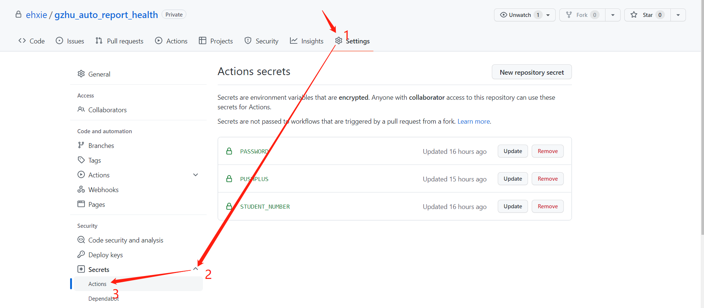
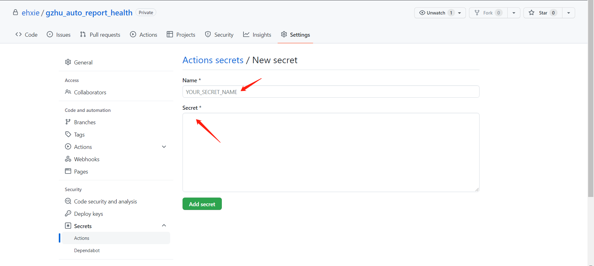
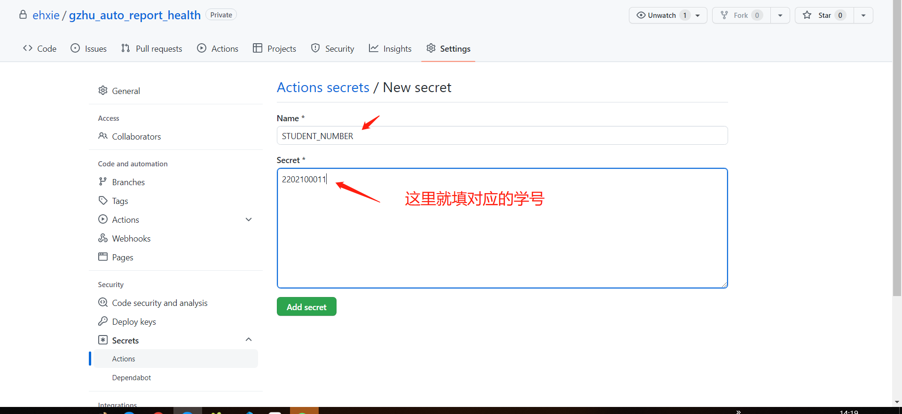
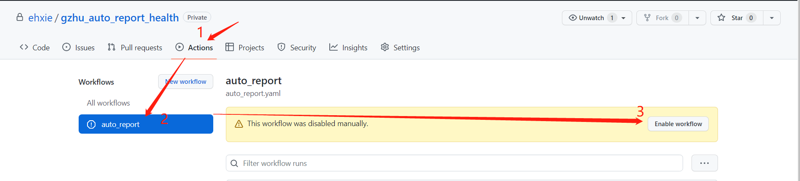
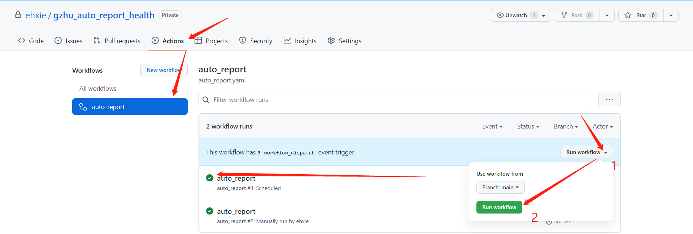
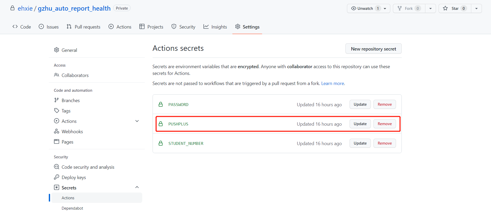

# 广州大学 GZhu 自动健康打卡 TypeScript 版

## 免责声明

本项目仅用于学习交流

[参考](https://github.com/ehxie/clockIn_gzhu)

## 功能简介

- 使用 Github Actions 实现广州大学自动健康打卡
- 账号密码均由自己秘密保存

## 使用指南

简单三步，开启自动健康打卡

- fork 本仓库
- 填写学号、密码（加密保存到**你自己**的仓库中）
- 开启自动打卡

1.`fork`本项目，跳转到另一个页面，再点击`creat fork`

2.设置学号、密码

- 依次点击`Settings` ——>`Secrets`——>`Actions`

- 点击`New repository secret`
  - Name：填入密钥名称
    - `STUDENT_NUMBER`：学号
    - `PASSWORD`：密码
  - Secret：填入密钥

例如：

3.开启自动打卡（Github Action）

- 开启 Github Action

**测试是否设置成功**

- 按下图步骤 1，2 触发自动打卡，等到前面图标变成`绿色的√`时自行查看健康打卡系统

## 拓展功能（可选）

### 结果通知

> 打卡结果通过微信公众号`pushplus 推送加`通知

1.关注微信公众号`pushplus 推送加`，它会返回一个 `token`（下图打码部分）

 

2.按照上面添加账号密码的方式添加一个 `secret`

- Name 为 PUSHPLUS，Secret 为步骤1获得的 token

